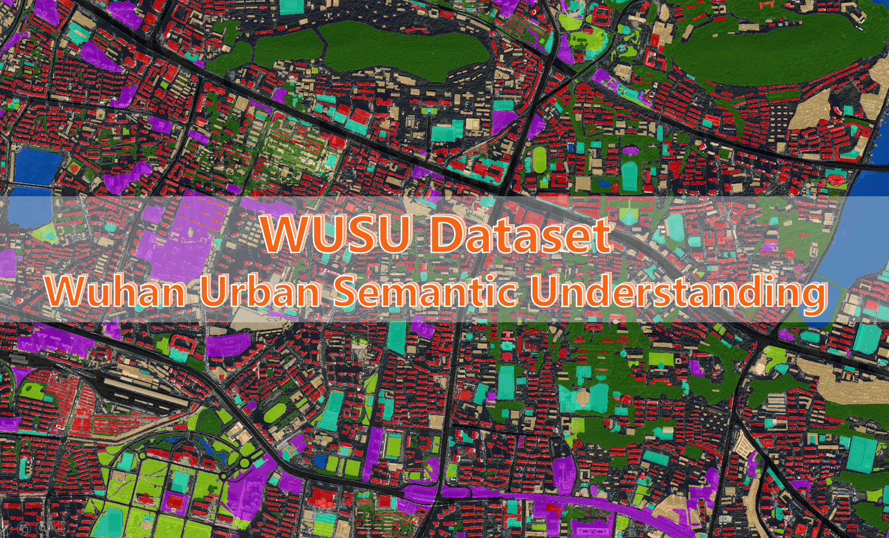

# WUSU: Wuhan Urban Semantic Understanding Dataset



## Introduction

WUSU is a semantic understanding dataset focusing on urban structure and the urbanization process in Wuhan, the main city of the Yangtze River Economic Belt. The dataset covers key development areas including Jiang'an District and Hongshan District, spanning a total geographic area of nearly $80 \space km^2$. 

The dataset includes high resolution, tri-temporal, and multi-spectral satellite images of these districts, offering unprecedented detail and continuity in the representation of urban changes. 

## Dataset Details

### Image Pre-processing

The images in this dataset were obtained from GF-2 satellite imagery and were selected with a maximum cloud cover of 5%. These images then underwent several pre-processing steps, including PAN and MSS image orthographic correction and image pan sharpening. 

Multi-temporal image registration was also performed to ensure suitability for change detection tasks, with a requirement that the root-mean-square error (RMSE) was less than 1 pixel.

Finally, the images were cropped to the following dimensions:

- Images for Hongshan District are of size 6358×6382 pixels, and were obtained for the dates April 22, 2015, September 1, 2016, and November 23, 2018.
- Images for Jiang'an District are of size 7025×5500 pixels, and were obtained for the dates April 22, 2015, December 8, 2016, and November 23, 2018.

The result of this process was a set of 4-band fusion satellite images with a spatial resolution of 1 meter, providing a high-resolution view of the study areas.

### Label Generation

The WUSU dataset adopts the Chinese Land Use Classification Criteria (GB/T21010-2017) and the Contents and Indicators of the Chinese Geographical Conditions Census (GDPJ 01-2013).

**Class Legend:**
This system includes the following classes:
| Class | Color |
|-------|-------|
| 1-Road |  |
| 2-Low building |  |
| 3-High building |  |
| 4-Arable land |  |
| 6-Woodland |  |
| 7-Grassland |  |
| 8-River |  |
| 9-Lake |  |
| 10-Structure |  |
| 11-Excavation |  |
| 12-Bare surface |  |


## Dataset Download

Be uploaded soon…

## Public Datasets
Several public datasets with spatial resolution better than 10 m for land use/land cover classification, binary change detection and semantic change detection (excluding competition datasets) mentioned in our paper are as follows:

### Public datasets for land use/land cover classification
1.  ISPRS 2D Semantic Labeling Contest dataset. [<a href="https://www.isprs.org/education/benchmarks/UrbanSemLab/default.aspx" target="_blank">Download</a>] [<a href="https://www.repo.uni-hannover.de/handle/123456789/5086" target="_blank">CrossRef</a>] </span>

2.  Zurich Summer v1.0 dataset. [<a href="https://zenodo.org/record/5914759" target="_blank">Download</a>] [<a href="https://www.cv-foundation.org/openaccess/content_cvpr_workshops_2015/W13/papers/Volpi_Semantic_Segmentation_of_2015_CVPR_paper.pdf" target="_blank">CrossRef</a>] </span>

3.  Aerial Image Segmentation dataset. [<a href="https://zenodo.org/record/1154821#.XH6HtygzbIU" target="_blank">Download</a>] [<a href="https://ieeexplore.ieee.org/abstract/document/7987710" target="_blank">CrossRef</a>] </span>

4.  EvLab-SS dataset. [<a href="http://earthvisionlab.whu.edu.cn/zm/SemanticSegmentation/index.html" target="_blank">Download</a>] [<a href="https://www.mdpi.com/2072-4292/9/5/500" target="_blank">CrossRef</a>] </span>

5.  DeepGlobe Land Cover Classification Challenge dataset. [<a href="http://deepglobe.org/challenge.html" target="_blank">Download</a>] [<a href="https://openaccess.thecvf.com/content_cvpr_2018_workshops/papers/w4/Demir_DeepGlobe_2018_A_CVPR_2018_paper.pdf" target="_blank">CrossRef</a>] </span> 

6.  Dense Labelling Remote Sensing Dataset (DLRSD). [<a href="https://competitions.codalab.org/competitions/18468" target="_blank">Download</a>] [<a href="https://pdfs.semanticscholar.org/0524/20a902559352b5d27e71f1600cadd6ed465e.pdf" target="_blank">CrossRef</a>] </span> 

7.  Gaofen Image Dataset (GID). [<a href="http://captain.whu.edu.cn/GID/" target="_blank">Download</a>] [<a href="https://www.sciencedirect.com/science/article/abs/pii/S0034425719303414" target="_blank">CrossRef</a>] </span>

8.  Wuhan Dense Labeling Dataset (WHDLD). [<a href="https://faculty.nuist.edu.cn/zhouwx/zh_CN/zdylm/123271/list/index.htm" target="_blank">Download</a>] [<a href="https://ieeexplore.ieee.org/abstract/document/8954885" target="_blank">CrossRef</a>] </span>

9.  Land-cOVEr Domain Adaptive semantic segmentation (LoveDA) dataset. [<a href="https://github.com/Junjue-Wang/LoveDA" target="_blank">Download</a>] [<a href="https://arxiv.org/abs/2110.08733" target="_blank">CrossRef</a>] </span>

10. WHU-OPT-SAR dataset. [<a href="https://github.com/AmberHen/WHU-OPT-SAR-dataset" target="_blank">Download</a>] [<a href="https://www.sciencedirect.com/science/article/pii/S0303243421003457" target="_blank">CrossRef</a>] </span>


### Public datasets for binary change detection
1.  SZTAKI Air Change dataset. [<a href="http://web.eee.sztaki.hu/remotesensing/airchange_benchmark.html" target="_blank">Download</a>] [<a href="https://ieeexplore.ieee.org/abstract/document/5169964" target="_blank">CrossRef</a>] </span>

2.  ABCD dataset (for building). [<a href="https://github.com/gistairc/ABCDdataset" target="_blank">Download</a>] [<a href="https://ieeexplore.ieee.org/abstract/document/7986759" target="_blank">CrossRef</a>] </span>

3.  WHU building dataset (for building). [<a href="http://gpcv.whu.edu.cn/data/building_dataset.html" target="_blank">Download</a>] [<a href="https://ieeexplore.ieee.org/abstract/document/8444434" target="_blank">CrossRef</a>] </span>

4.  CDD Dataset (season-varying). [<a href="https://drive.google.com/file/d/1GX656JqqOyBi_Ef0w65kDGVto-nHrNs9" target="_blank">Download</a>] [<a href="https://pdfs.semanticscholar.org/ae15/e5ccccaaff44ab542003386349ef1d3b7511.pdf" target="_blank">CrossRef</a>] </span>

5.  LEVIR-CD dataset (for building). [<a href="https://justchenhao.github.io/LEVIR/" target="_blank">Download</a>] [<a href="https://www.mdpi.com/2072-4292/12/10/1662" target="_blank">CrossRef</a>] </span>

6.  Google (CD_Data_GZ) dataset. [<a href="https://github.com/daifeng2016/Change-Detection-Dataset-for-High-Resolution-Satellite-Imagery" target="_blank">Download</a>] [<a href="https://ieeexplore.ieee.org/abstract/document/9161009" target="_blank">CrossRef</a>] </span>

7.  LEVIR-CD+ dataset (for building). [<a href="https://github.com/S2Looking/Dataset" target="_blank">Download</a>] [<a href="https://www.mdpi.com/2072-4292/13/24/5094" target="_blank">CrossRef</a>] </span>

8.  S2Looking dataset (for building). [<a href="https://github.com/S2Looking/Dataset" target="_blank">Download</a>] [<a href="https://www.mdpi.com/2072-4292/13/24/5094" target="_blank">CrossRef</a>] </span>

9.  Satellite-UAV heterogeneous image change detection (HTCD). [<a href="https://github.com/ShaoRuizhe/SUNet-change_detection" target="_blank">Download</a>] [<a href="https://www.mdpi.com/2072-4292/13/18/3750" target="_blank">CrossRef</a>] </span>

10. Sun Yat-Sen University (SYSU)-CD dataset. [<a href="https://github.com/liumency/SYSU-CD" target="_blank">Download</a>] [<a href="https://ieeexplore.ieee.org/abstract/document/9467555" target="_blank">CrossRef</a>] </span>

11. Cropland change detection (CLCD) dataset. [<a href="https://github.com/liumency/CropLand-CD" target="_blank">Download</a>] [<a href="https://ieeexplore.ieee.org/abstract/document/9780164" target="_blank">CrossRef</a>] </span>

12. Multisource built-up change (MSBC) datasets. [<a href="https://github.com/Lihy256/MSCDUnet" target="_blank">Download</a>] [<a href="https://ieeexplore.ieee.org/abstract/document/9791854" target="_blank">CrossRef</a>] </span>


### Public datasets for semantic change detection
1.  High Resolution Semantic Change Detection (HRSCD) dataset. [<a href="https://ieee-dataport.org/open-access/hrscd-high-resolution-semantic-change-detection-dataset" target="_blank">Download</a>] [<a href="https://www.sciencedirect.com/science/article/abs/pii/S1077314219300992" target="_blank">CrossRef</a>] </span>

2.  Hi-UCD mini dataset. [<a href="https://github.com/Daisy-7/Hi-UCD-S" target="_blank">Download</a>] [<a href="https://arxiv.org/abs/2011.03247" target="_blank">CrossRef</a>] </span>

3.  SECOND dataset. [<a href="http://www.captain-whu.com/project/SCD" target="_blank">Download</a>] [<a href="https://ieeexplore.ieee.org/abstract/document/9555824" target="_blank">CrossRef</a>] </span>

4.  Hi-UCD dataset. [<a href="https://github.com/Daisy-7/Hi-UCD-S" target="_blank">Download</a>] [<a href="https://www.sciencedirect.com/science/article/abs/pii/S0924271622002210" target="_blank">CrossRef</a>] </span>


## License

The WUSU dataset is made available under the [Open Database License](http://opendatacommons.org/licenses/odbl/1.0/). Any rights in individual contents of the database are licensed under the [Database Contents License](http://opendatacommons.org/licenses/dbcl/1.0/).


## Citing

If you use WUSU dataset, codebase or models in your research, please consider citing our paper. [<a href="https://doi.org/10.1080/17538947.2023.2246445" target="_blank">Open Access</a>]

```
@Article{shi2023openWUSU,
AUTHOR = {Shi, Sunan and Zhong, Yanfei and Liu, Yinhe and Wang, Jue and Wan, Yuting and Zhao, Ji and Lv, Pengyuan and Zhang, Liangpei and Li, Deren},
TITLE = {Multi-temporal urban semantic understanding based on GF-2 remote sensing imagery: from tri-temporal datasets to multi-task mapping},
JOURNAL = {International Journal of Digital Earth},
VOLUME = {16},
YEAR = {2023},
ISSUE = {1},
PAGES={3321-3347},
DOI = {10.1080/17538947.2023.2246445}
}
```
  
##### Reference materials:  
* [MinZHANG-WHU/Change-Detection-Review](https://github.com/MinZHANG-WHU/Change-Detection-Review)
* [wenhwu/awesome-remote-sensing-change-detection](https://github.com/wenhwu/awesome-remote-sensing-change-detection)
